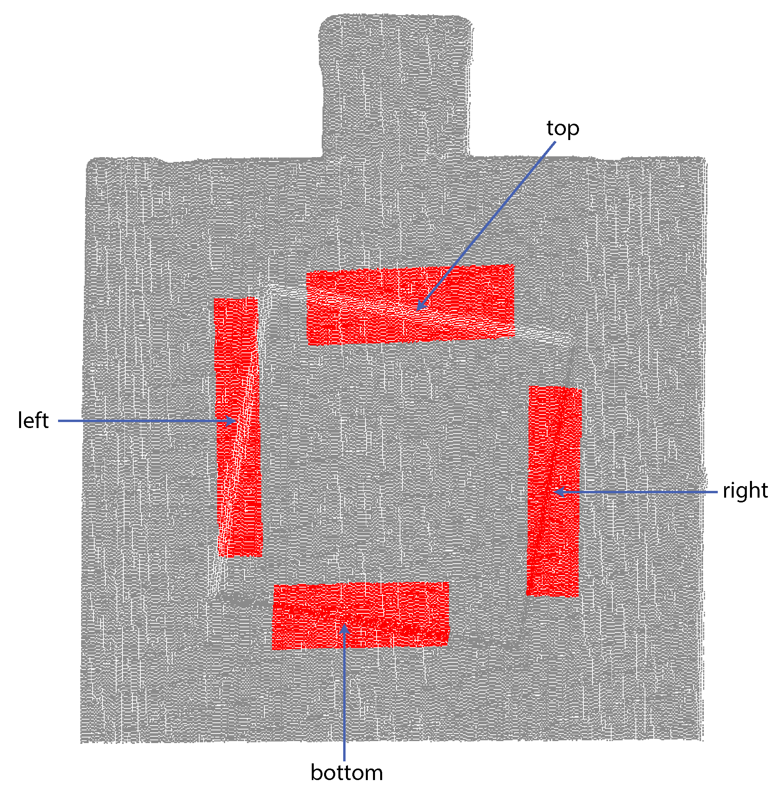

# Beam Parameter Estimation 
This repository provides the code and a dataset to estimate the beam dimensions and beam parameters for a mixed-pixel experimental setup. It represents the official implementation of the beam parameter estimation part of the paper:

### [A Modeling Approach for Predicting the Resolution Capability in Terrestrial Laser Scanning](https://www.mdpi.com/2072-4292/13/4/615)
[Sukant Chaudhry](https://www.researchgate.net/profile/Sukant_Chaudhry), [David Salido-Monzú](https://www.researchgate.net/profile/David_Salido-Monzu), [Andreas Wieser](https://baug.ethz.ch/departement/personen/mitarbeiter/personen-detail.MTg3NzU5.TGlzdC82NzksLTU1NTc1NDEwMQ==.html)\
| [IGP ETH Zurich](https://igp.ethz.ch/) |

### Environment Setup

> Note: The code in this repository has been implemented in MATLAB and will require the user to install MATLAB.
 

After cloning this repository, you can use the code to estimate beam shape parameters for any dataset acquired by you or the sample dataset provided in the `Data` directory. An example of the provided sample dataset is depicted in Figure 9(a) of our paper. 


### Methodology in a Nutshell

The following steps are important to follow:


1.  The user needs to cut a point cloud consisting of the foreground and the background plane, as shown in the figure below (grey point cloud).

2.  The user needs to cut a band of profiles which clearly extends from the background surface to the foreground one, depicted as red colored points in the figure below. Cut this band of profiles along any of the four edges depending on which dimension of the footprint (FP) needs to be estimated. Cut left or right side profiles along the quasi-vertical edges to estimate the horizontal beam radius. Similarly, cut profiles along the top or bottom quasi-horizontal edges to estimate the vertical beam radius. The figure below shows a foreground and a background plane in grey and four bands of profiles in red to illustrate the definition of left/right/top/bottom profiles.

<p align="center">
  
</p>

3.  Save the cut point clouds. The following point cloud formats are supported: *.asc*, *.txt*, *.ply*, and *.pcd*. Verify that the first three columns of the point cloud files correspond to X, Y, and Z cartesian coordinates in [m].

4.  When both point cloud files are prepared, the user needs to enter the essential details in the script `BeamProfiling_Script.m`. First, specify the *paths* to the cut point clouds:
    ```
    dir_pc = '.\Data\EHR_PQ_21m.asc'; % path of the entire point cloud
    dir_profiles = '.\Data\EHR_PQ_21m_top.asc';  % path of the selected point cloud profile
    ```
    Next, specify the *tilt angle* of the foreground plane (set as 10 degrees in our experiments), the *reflectances* of the foreground and background surfaces (taken as equal in our experiments), and the location *Flag_side* of the profile ('left' or 'right' or 'top' or 'bottom'). Note that the location of the profile is a crucial input parameter and needs to be set correctly. Follow the convention as introduced in the figure above.

5. Once the user has acquired beam shape parameters for various distances, the script `estimate_beamparams.m` can be used to estimate the beam parameters in both horizontal and vertical dimension, which are:

     * beam focal position f<sub>0</sub> and its standard deviation σ<sub>f<sub>0</sub></sub>
     * beam waist radius w<sub>0</sub> and its standard deviation σ<sub>w<sub>0</sub>
     * beam divergence half angle Θ<sub>0</sub> and its standard deviation σ<sub>Θ<sub>0</sub></sub> 

> Please note that in the script `estimate_beamparams.m`, the values of beam shape parameter for both horizontal and vertical dimension are included. This allows the user to use the values as an example set and to reproduce the results in our paper (Table 2). Please uncomment the values for which you want to estimate the beam parameters and run the script. 

> Note: All the function files used in the two scripts for the computation of the beam dimensions and the beam parameters are located in the `source` directory.


### Data
The point cloud of the foreground and background plane acquired using Z&F Imager 5016 scanner is provided in the `Data` directory:
```
.\Data\EHR_PQ_21m.asc
```
This file contains the entire point cloud including the tilted foreground plane and the background plane along with the spectralon target installed on top. EHR stands for the extremely high resolution setting (0.8 mm @ 10 m) and PQ for premium quality. The scan is acquired at 21 m distance. 

Furthermore, individual band of profiles are provided, which follow the same filename convention:
```
.\Data\EHR_PQ_21m_left.asc - for left quasi-vertical edge: to compute horizontal beam shape parameter
.\Data\EHR_PQ_21m_right.asc - for right quasi-vertical edge: to compute horizontal beam shape parameter
.\Data\EHR_PQ_21m_top.asc - for top quasi-horizontal edge: to compute vertical beam shape parameter
.\Data\EHR_PQ_21m_bottom.asc - for bottom quasi-horizontal edge: to compute vertical beam shape parameter
```


### Citation

If you found this code or paper useful, please consider citing:

```
@article{chaudhry2021modeling,
  title={A Modeling Approach for Predicting the Resolution Capability in Terrestrial Laser Scanning},
  author={Chaudhry, Sukant and Salido-Monz{\'u}, David and Wieser, Andreas},
  journal={Remote Sensing},
  volume={13},
  number={4},
  pages={615},
  year={2021},
  publisher={Multidisciplinary Digital Publishing Institute}
}
```
### Contact
If you run into problems or have any questions, please create an issue or contact sukants@ethz.ch


